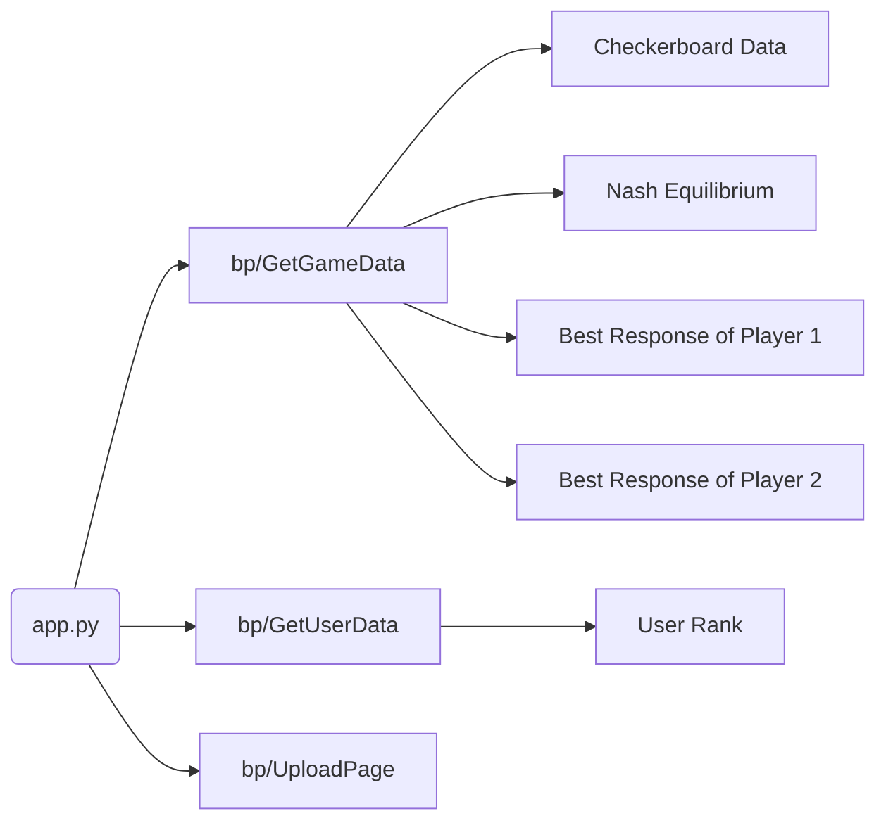

# Nashsweeper Back-end
## 0x00 Main Tech Stack
* [Python Flask Framework](https://flask.palletsprojects.com/en/2.2.x/): A micro-service framework using Python and realize a web backend server.
* [Miniconda](https://docs.conda.io/en/latest/miniconda.html): Miniconda is a free minimal installer for conda. It is a small, bootstrap version of Anaconda that includes only conda, Python, the packages they depend on, and a small number of other useful packages, including pip, zlib and a few others. Use the conda install command to install 720+ additional conda packages from the Anaconda repository.
* [Python Sqlite](): A Python standard library as a database. 
## 0x01 Run this Project
### Install [Miniconda](https://docs.conda.io/en/latest/miniconda.html) firstly
In order to keep your OS environment clean, we strongly recommend that you can use conda to create Python virtual environment.
### Create Conda Environment
```bash
# Create a conda env named nashsweeper
$ conda create -n nashsweeper python=3.9
# activate nashsweeper with conda
$ conda activate nashsweeper
# install pip dependencies
$ pip install -r requirements.txt
```
### Run Backend Server (Linux and Mac OS)
```bash
# make sure conda env is nashsweeper
# cd /path/to/nashsweeper-backend
# set flask environment variables
# In Dev Mode
$ export FLASK_DEBUG=True
$ export FLASK_APP=src
# initialize database
$ flask init-db
# Run!
$ flask run
```
### Run Backend Server (Windows OS)
```bash
# make sure conda env is nashsweeper
# cd /path/to/nashsweeper-backend
# set flask environment variables
$ set FLASK_DEBUG=True
$ set FLASK_APP=src
# initialize database
$ flask init-db
# Run!
$ flask run
```
## 0x02 Docker Deployment
```bash
$ sudo docker build -t nashsweeper-backend . 
$ sudo docker run --name nashsweeper-backend -d -p 5000:5000 nashsweeper-backend:latest
```
## 0x03 Backend Programme Architecture
